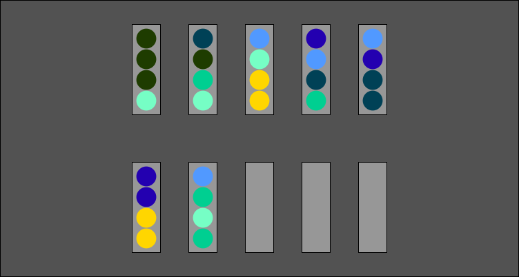
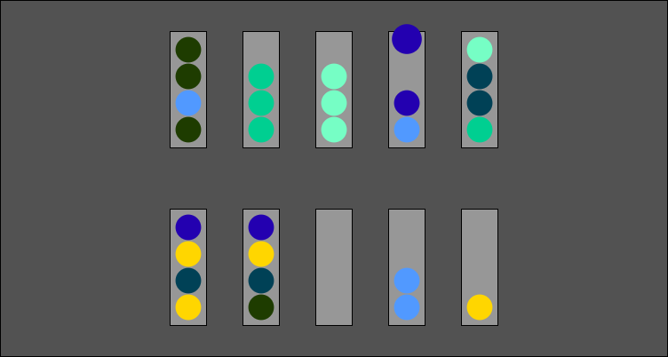
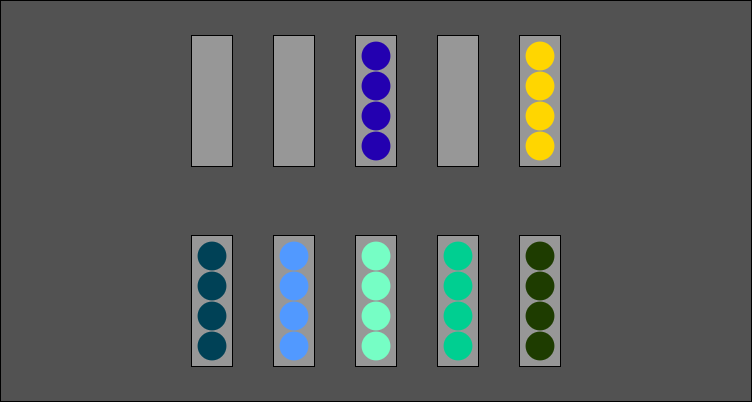

# Игра для сортировки шариков по цветам

Перемещайте цветные шарики до тех пор, пока все шарики не будут одного цвета

# Для запуска

> Необходимы глобальные зависимости:
>
> 1. [NodeJS](https://nodejs.org/en/)
> 1. [TypeScript](https://www.npmjs.com/package/typescript)
> 1. [TS-Node](https://www.npmjs.com/package/ts-node)
> 1. [WebPack](https://www.npmjs.com/package/webpack)
> 1. [WebPack-cli](https://www.npmjs.com/package/webpack-cli)
> 1. [WebPack-dev-Server](https://www.npmjs.com/package/webpack-dev-server)
>


# Команды


Запуск собранной версии
```bash
> npm start
```

Сборка на публикацию
```bash
> npm run build
```

Сборка на тестирование
```bash
> npm run build-dev
```

Запуск без необходимости сборки
```bash
> npm run start
```

# Скриншоты

>
> 
>
> 
>
> 
>